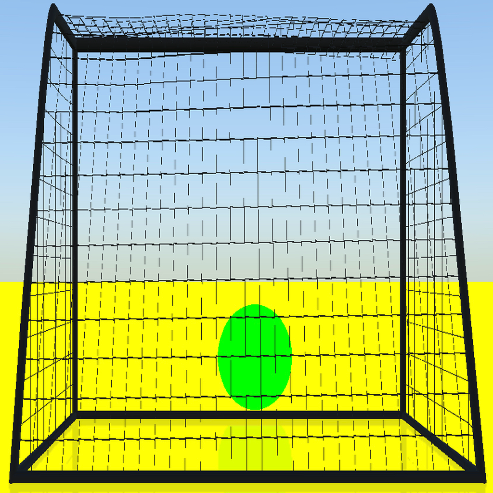

# CATCH THE BALL

## Introduction

Finally, today my another project goes to mothball. I wanted to gain experience in SceneKit and RealityKit frameworks. The idea of the game was taken from original Xbox 360 game for Kinect. When I learned at WWDC, that RealityKit let's you use motion capture feature, the next thing I knew was that I wanted to implement the idea of "Catch the ball" into iOS. In general, you need an Airplay compatible TV or a lighting cable with QuickTime Player enabled with iPhone screen mirroring. Another requirement is to have iPhone oraz iPad compatible with ARKit.

There is a lot of improvement that can be done, but I approached to this game as a challenge. Soon I will also publish the source code. Stay tuned!

MoCap is available on A12 & later

## Roadmap:

 * [x] Implement startup
 * [x] Implement end
 * [x] Add button for arms up
 * [x] Adjust values
 * [x] Fix translation

##

